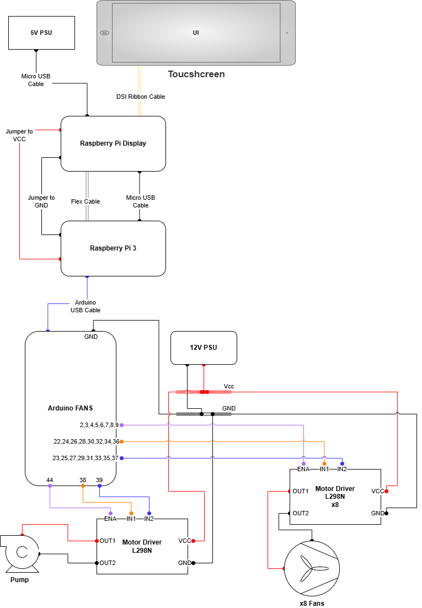
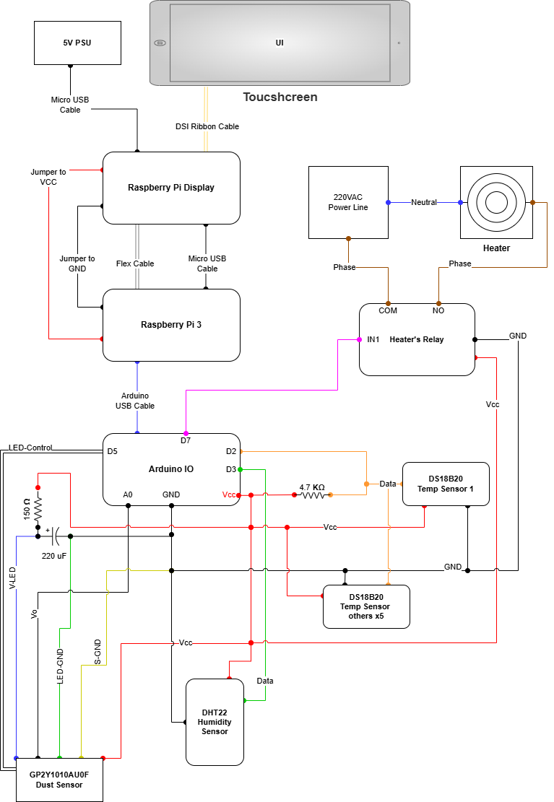

# Free-Space Optical (FSO) Channel Environmental Control System

## Overview

This project presents an embedded control system developed for environmental simulation in a Free-Space Optical (FSO) communication test platform.

The system integrates a Raspberry Pi-based touchscreen interface with an Arduino Mega 2560 microcontroller to provide real-time environmental monitoring and multi-channel actuator control.

The architecture follows a distributed control model:

- Raspberry Pi → Supervisory UI & control logic
- Arduino Mega → Real-time hardware IO handling
- USB Serial Communication → 9600 baud

---

## System Architecture

The system uses a distributed supervisory control architecture where the Raspberry Pi handles user interaction and high-level logic, while the Arduino Mega performs deterministic hardware-level operations.

### Architecture Diagram

---

## Hardware Design

### Fan & Pump Control

- Arduino Mega 2560
- L298N motor drivers
- PWM-based speed control
- 12V power supply for actuators
- Common ground across all modules

### Fan Driver Schematic

---

### Sensor & IO Interface

Environmental monitoring components:

- DHT22 – Humidity sensor
- DS18B20 – Temperature sensors (OneWire, 4.7kΩ pull-up)
- GP2Y1010AU0F – Dust sensor (220µF capacitor + 150Ω resistor)
- 5V Opto-isolated 2-channel relay module
- 220VAC heater switching via COM–NO configuration

### IO & Sensor Schematic

---

## Functional Capabilities

The system enables:

- Real-time temperature, humidity, and dust monitoring
- Manual multi-channel fan speed adjustment
- Pump speed control via PWM
- Heater ON/OFF switching
- Touchscreen-based supervisory control
- Serial-based actuator command protocol

This configuration allows flexible environmental parameter tuning during FSO experimental simulations.

---

## Communication Layer

- USB Serial Communication
- Baud Rate: 9600
- Command-based actuator control protocol
- Periodic sensor data transmission to Raspberry Pi

---

## Software Architecture

### Raspberry Pi (Python)

- Touchscreen UI implementation
- Serial communication interface
- Manual supervisory control logic
- Real-time sensor visualization

### Arduino (C/C++)

- PWM signal generation
- Sensor data acquisition
- Serial command parsing
- Relay switching control

---

## Engineering Highlights

- Multi-device embedded system integration
- Mixed-voltage design (5V / 12V / 220VAC)
- Opto-isolated relay switching
- Real-time hardware control
- Practical serial protocol implementation
- System-level debugging and hardware validation

---

## Future Scope (Conceptual)

- Closed-loop environmental automation
- PID-based actuator regulation
- Enhanced communication protocol
- Remote monitoring capability
